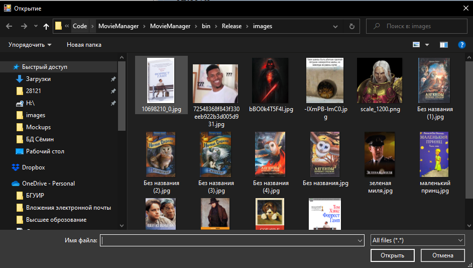

# Требования к проекту
---

# Содержание
1 [Введение](#intro)  
1.1 [Назначение](#appointment)  
1.2 [Бизнес-требования](#business_requirements)  
1.2.1 [Исходные данные](#initial_data)  
1.2.2 [Возможности бизнеса](#business_opportunities)  
1.2.3 [Границы проекта](#project_boundary)  
1.3 [Аналоги](#analogues)  
2 [Требования пользователя](#user_requirements)  
2.1 [Программные интерфейсы](#software_interfaces)  
2.2 [Главная форма](#main_form) 
2.2.1 [Панель "средства для поиска"](#search_tools) 
2.2.1.1 [Поисковая строка](#search_string) 
2.2.1.2 [Панель параметров для поиска](#search_parametrs) 
2.2.1.3 [Окно результатов поиска](#search_results) 
2.2.2 [Кнопка "New item"](#New_item) 
2.2.3 [Кнопка "Delete item"](#Delete_item) 
2.2.4 [Панель "Movies/books"](#Movies/books) 
2.2.5 [Панель "Info"](#Info) 
2.3 [Характеристики пользователей](#user_specifications)  
2.3.1 [Классы пользователей](#user_classes)  
2.3.2 [Аудитория приложения](#application_audience)  
2.3.2.1 [Целевая аудитория](#target_audience)  
2.3.2.2 [Побочная аудитория](#collateral_audience)  
2.4 [Предположения и зависимости](#assumptions_and_dependencies)  
3 [Системные требования](#system_requirements)  
3.1 [Функциональные требования](#functional_requirements)  
3.1.1 [Основные функции](#main_functions)  
3.1.1.1 [Вход пользователя в приложение](#user_logon_to_the_application)  
3.1.1.2 [Добавление фильма/книги](#download_news)  
3.1.1.3 [Просмотр информации об отдельном фильме/книге](#view_information_about_an_individual_newsletter)  
3.1.1.4 [Выход пользователя из приложения](#active_user_change)  
3.1.2 [Ограничения и исключения](#restrictions_and_exclusions)  
3.2 [Нефункциональные требования](#non-functional_requirements)  
3.2.1 [Атрибуты качества](#quality_attributes)  
3.2.1.1 [Требования к удобству использования](#requirements_for_ease_of_use)  
3.2.1.2 [Требования к безопасности](#security_requirements)  
3.2.2 [Внешние интерфейсы](#external_interfaces)  
3.2.3 [Ограничения](#restrictions)  

<a name="intro"/>

# 1 Введение

<a name="appointment"/>

## 1.1 Назначение
В этом документе описаны функциональные и нефункциональные требования к приложению «Менеджер фильмов и книг» для ОС Windows 10. Этот документ предназначен для команды, которая будет реализовывать и проверять корректность работы. 

<a name="business_requirements"/>

## 1.2 Бизнес-требования

<a name="initial_data"/>

### 1.2.1 Исходные данные
В наше время большинство людей старшей возрастной категории до сих пор ведут бумажные записи о своей коллекции книг, или фильмов. Однако, не каждый человек из представленной возрастной группы может предусмотреть рациональную организацию данных в бумажном справочнике. Поэтому поиск определённой книги, или фильма в таких условиях сопряжено с потерей времени на выборку. В связи с такой ситуацией многие из представителей данной возрастной категории начинают использовать компьютерные технологии для упрощения и рационализации организации своих медиа коллекций. Большинство из них не обладает достаточной технической грамотностью для использования приложений, рассчитанных на продвинутых пользователей. Это приводит к тому, что многие возвращаются к привычным способам получения информации.

<a name="business_opportunities"/>

### 1.2.2 Возможности бизнеса
Многие люди желают иметь приложение, которое позволит оперативно получать информацию о книгах/фильмах, обладая минимальной технической грамотностью. Подобное приложение позволит им тратить меньше времени на поиск необходимой информации. Интерфейс, спроектированный с учётом особенностей тихнически малограмотной категории людей, и дополнение приложения подробной инструкцией позволят увеличить количество людей, использующих данное приложение.

<a name="project_boundary"/>

### 1.2.3 Границы проекта
Приложение «Менеджер фильмов и книг» позволит пользователям добавлять, удалять, просматривать и редактировать информацию о книгах/фильмах, отобранных согласно параметрам поиска.

<a name="analogues"/>

## 1.3 Аналоги
Обзор аналогов представлен в документе [Overview of analogues](../Requirements/Overview%20of%20analogues.md).

<a name="user_requirements"/>

# 2 Требования пользователя

<a name="software_interfaces"/>

## 2.1 Программные интерфейсы
Приложение, по сути, представляет собой систему управления json файлом. Json файлом, который содержит данные объекта (фильма/книги).

<a name="main_form"/>

## 2.2 Главная форма
  
Главная форма состоит из следующих компонентов: 

<a name="search_tools"/>

### 2.2.1 средства для поиска
 
"средства для поиска" состоит из следующих компонентов:

<a name="search_string"/>

#### 2.2.1.1 Поисковая строка и кнопка "Search"
 
Поисковая строка — это поле, куда пользователь вводит свой запрос.

Для поиска, пользователю следует проделать следующие действия:
1. Активировать поисковую строку.
2. Ввести свой запрос.
3. Нажать кнопку "Search".
После нажатия кнопки "Search" появляется окно с результатоми поиска.

<a name="search_parametrs"/>

#### 2.2.1.2 Панель параметров для поиска
 
Данная панель состоит из чекбоксов для фильтраци поиска. 
Чекбоксы:
* Name - для поиска по имени;
* Date - для поиска по дате;
* Authors - для поиска по авторам;
* Country - для поиска по странам.
Также для поиска фильма/книги нужно находиться в соотвествующей вкладке "Movies/Books". 

<a name="search_results"/>

#### 2.2.1.3 Окно результатов поиска с кнопкой "Close"
 
Данное окно предназначено для выбора результата поиска. 
После выбора результата на панели "Info" появиться информация о выбранном элементе. 
После выбора элемента для закрытия окна результатов нажать кнопку "Close".

<a name="New_item"/>

### 2.2.2 Кнопка "New item"
 
Кнопка "New item" предназначена для очистки панели "Info" и создания нового объекта после заполнения полей на понели Info. 
Для создания нового объека, поле "Name" на понели "Info" не должно быть пустым, иначе 

 .
После успешного создания появится окно 

 .

<a name="Delete_item"/>

### 2.2.3 Кнопка "Delete item"
 
Кнопка "Delete item" предназначена для удаления выбранного объекта на панели Movies/Books.
После успешного удаления появиться окно 

 .

<a name="Movies/books"/>

### 2.2.4 Панель "Movies/books"
 
Панель "Movies/books" содержит две вкладки: 
Вкладка "Movies" содержит в себе список фильмов; 
Вкладка "Books" содержит в себе список книг.
При выборе объекта из списка на панели "Info" отображается о нем информация.

<a name="Info"/>

### 2.2.5 Панель "Info"
 
В понели "Info" отображается информация о выбранном объекте.
Понель "Info" состоит из полей Date, Authors, Country, Name, Description.
А также из кнопок "Save Settings", "Load new", и области для изображения Artcover.
Поля Date, Authors, Country предназначены для даты, имени автора и страны соответственно.
 

Поля Name, Description предназначены для имени и общего описания объека соответственно.
 

Кнопка "Load new" предназначена для установки обложки "Artcover".
Нажимаем "Load new"

 
выбираем изображение
 
и получаем результат

 

Кнопка "Save Settings" предназначена для сохранения объекта при изменении его полей или обложки.

 
после успешного сохранения появляется окно

 

## 2.3 Характеристики пользователей

<a name="user_classes"/>

### 2.3.1 Классы пользователей

| Класс пользователей | Описание |
|:---|:---|
| Произвольный пользователь | Имеет доступ к полному функционалу |

<a name="application_audience"/>

### 2.3.2 Аудитория приложения

<a name="target_audience"/>

#### 2.3.2.1 Целевая аудитория
Люди старшей возрастной категории со средним или выше среднего уровнем образования, обладающие минимальной технической грамотностью.

<a name="collateral_audience"/>

#### 2.3.2.2 Побочная аудитория
Люди средней возрастной категории, обладающие вышеперечисленными качествами.

<a name="assumptions_and_dependencies"/>

## 2.4 Предположения и зависимости
Приложение не требует подключения к Интернету;

<a name="system_requirements"/>

# 3 Системные требования

<a name="functional_requirements"/>

## 3.1 Функциональные требования

<a name="main_functions"/>

### 3.1.1 Основные функции

<a name="user_logon_to_the_application"/>

#### 3.1.1.1 Вход пользователя в приложение
**Описание.** В приложении не предусмотренно создание собственного профиля

<a name="download_news"/>

#### 3.1.1.2 Настройка профиля активного пользователя
**Описание.** Пользователь имеет возможность создавать, искать, редактировать и удалять объект описывающий фильм/книгу.

| Функция | Требования | 
|:---|:---|
| Добавление фильмов/книг | Приложение предоставляет пользователю возможность создавать список фильмов/книг в специальном поле. |
| Сортировка фильмов/книг| Сортировка в алфавитном порядке по умолчанию |
| Поиск фильмов/книг | Пользователь может осуществить контекстный поиск фильмов/книг по полям, устанавливая чекбокс необходимого поля |
| Редактирование фильмов/книг | Пользователь имеет возможность выделить интересующий его фильм/книгу в списке фильмов/книг и уточнить его данные на специальной панеле в специальных полях |
| Удаление фильма/книги | Пользователь имеет возможножность выделить интересующий его фильм/книгу в списке фильмов/книг и удалить его |

<a name="download_news"/>

#### 3.1.1.3 Добавление контактов
**Описание.** После запуска приложения можно добавить фильм/книгу.

| Функция | Требования | 
|:---|:---|
| Добавление фильма/книги | Если нужно добавить фильм/книгу, то на главной форме следует нажать кнопку "New item". При нажатии кнопки очистяться поля на понели "Info". После заполнения полей, нужно снова нажать кнопку "New item". |

<a name="view_information_about_an_individual_newsletter"/>

#### 3.1.1.4 Просмотр информации об отдельном фильме/книге
**Описание.** Пользователь имеет возможность просмотреть информацию о каждом активном фильме/книге в специальной панеле "Info". Панель состоит из следующих категорий:

| Категория | Поля |
|:---|:---|
| Базовые данные |имя, дата, автор, страна, описание | 
| изображение | обложка |

<a name="active_user_change"/>

#### 3.1.1.5 Выход пользователя из приложения
**Описание.** для выхода из приложения надо нажать кнопку в виде буквы "x" в правом верхнем углу.

<a name="restrictions_and_exclusions"/>

### 3.1.2 Ограничения и исключения
1. Для работы приложения не требуется наличия подключения к Интернету;

<a name="non-functional_requirements"/>

## 3.2 Нефункциональные требования

<a name="quality_attributes"/>

### 3.2.1 Атрибуты качества

<a name="requirements_for_ease_of_use"/>

#### 3.2.1.1 Требования к удобству использования
1. Доступ к основным функциям приложения не более чем за две операции;
2. Все функциональные элементы пользовательского интерфейса имеют названия, описывающие действие, которое произойдет при выборе элемента;
3. Пошаговая инструкция использования основных функций приложения отображена в справке.

<a name="security_requirements"/>

#### 3.2.1.2 Требования к безопасности
Приложение предоставляет возможность взаимодействия только с активным пользователем.

<a name="external_interfaces"/>

### 3.2.2 Внешние интерфейсы
Окна приложения удобны для использования пользователями с плохим зрением:
  * размер шрифта не менее 14пт;
  * функциональные элементы контрастны фону окна.

<a name="restrictions"/>

### 3.2.3 Ограничения
1. Приложение реализовано в среде программирования «Visual Studio 2022»;