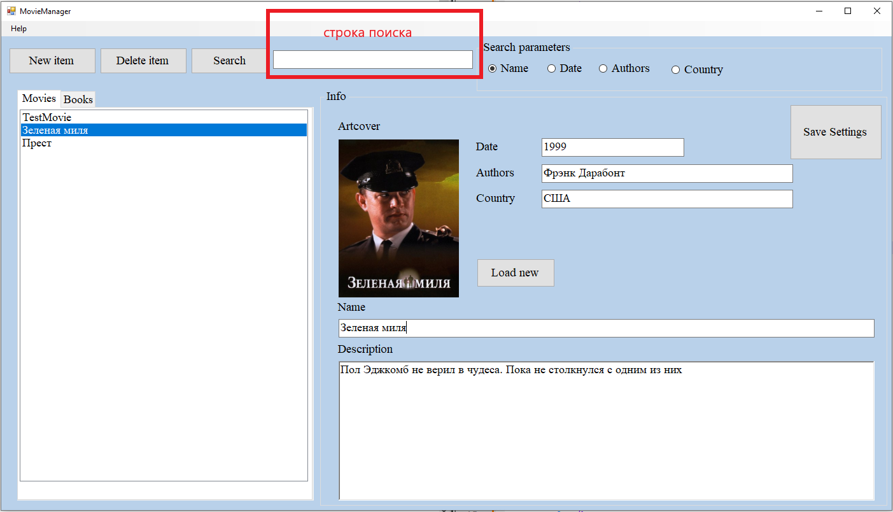
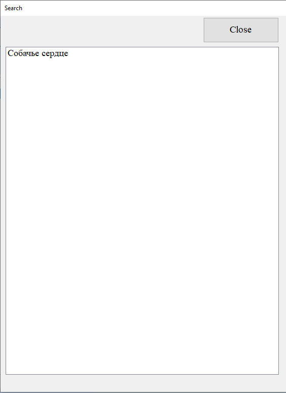
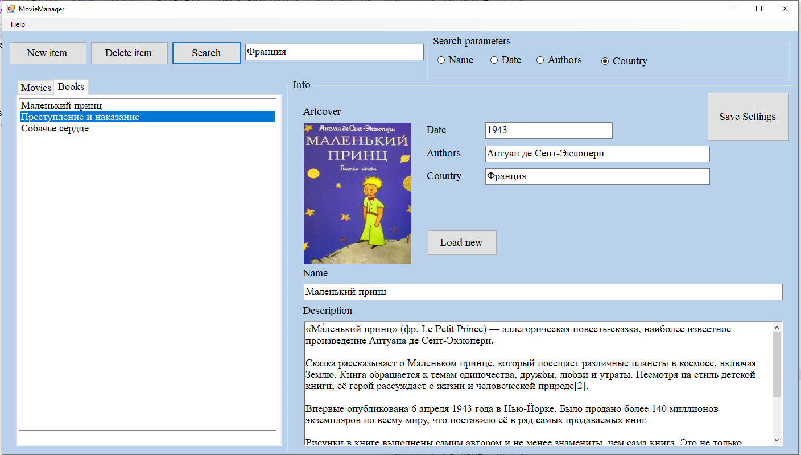

# Представление результатов

| ID | Назначение/название | Сценарий | Ожидаемый результат | Фактический результат | Оценка |
|:---:|:---:|:---|:---|:---|:---|
| 1 | Создание нового объекта списка фильма/книги | 1. Нажмите на кнопку "New item" ([см. рисунок 1](#1)), которая расположена на главной форме ([см. рисунок 2](#2)). 2. в очистившихся полях панели "Info" введите данные в соответствующие поля: name ("Зеленая миля"); Date ("1999"); Authors("Фрэнк Дарабонт"); Country("США"); Descriptions("Пол Эджкомб не верил в чудеса. Пока не столкнулся с одним из них"); Для добавления обложки в поле для изображения Artcover надо нажать кнопку "Load new" ([см. рисунок 3](#3)), в появившемся окне выбрать нужное изображение на своем компьютере и нажать "открыть". 3. Подтвердите ввод нажатием на кнопку "New item" ([см. рисунок 1](#1)). | Появилось окно "new item added" ([см. рисунок 4](#4)). На панели "Movies/Books" появился новый объект списка с названием "Зеленая миля" который вводили в поле "Name", а панель "Info" очистилась для создания нового объекта. Введённые данные нового объекта списка Movies/Books добавлены в Json файл и при выборе этого объекта отображены на панели "Info". | Появилось окно "new item added" ([см. рисунок 4](#4)). На панели "Movies/Books" появился новый объект списка с названием "Зеленая миля" который вводили в поле "Name", а панель "Info" очистилась для создания нового объекта. Введённые данные нового объекта списка Movies/Books добавлены в Json файл и при выборе этого объекта отображены на панели "Info". ([см. рисунок 5](#5)). | Успешно |
| 2 | Контекстный поиск по имени | 1. Активируйте поисковую строку ([см. рисунок 6](#6)), которая находится в верхней части главной формы ([см. рисунок 7](#7)). 2. На панели "Search parametrs" ([см. рисунок 8](#8)) выберите критерий поиска Name. Введите свой запрос ([см. рисунок 9](#9)) и нажмите кнопку "Search" ([см. рисунок 10](#10)). | Появиться окно "Search" с результатами поиска в соответствии с выбранным критерием. При выборе любого из найденных результатов, на понели "Info" поля заполнятся в соответствии с выбранным объектом. Окно "Search" закрывается по нажатию кнопки "Close".| Появиться окно "Search" ([см. рисунок 11](#11)) с результатами поиска в соответствии с выбранным критерием. При выборе любого из найденных результатов, на понели "Info" поля заполнятся в соответствии с выбранным объектом ([см. рисунок 12](#12)). Окно "Search" закрывается по нажатию кнопки "Close"([см. рисунок 13](#13)), ([см. рисунок 14](#14)). Поиск чувсвителен к регистру. | Успешно |
| 3 | Контекстный поиск по дате| 1. Активируйте поисковую строку ([см. рисунок 6](#6)), которая находится в верхней части главной формы ([см. рисунок 7](#7)). 2. На панели "Search parametrs" ([см. рисунок 15](#15)) выберите критерий поиска Date. Введите свой запрос ([см. рисунок 16](#16)) и нажмите кнопку "Search" ([см. рисунок 10](#10)). | Появиться окно "Search" с результатами поиска в соответствии с выбранным критерием. При выборе любого из найденных результатов, на понели "Info" поля заполнятся в соответствии с выбранным объектом. Окно "Search" закрывается по нажатию кнопки "Close".| Появиться окно "Search" ([см. рисунок 17](#17)) с результатами поиска в соответствии с выбранным критерием. При выборе любого из найденных результатов, на понели "Info" поля заполнятся в соответствии с выбранным объектом. Окно "Search" закрывается по нажатию кнопки "Close"([см. рисунок 13](#13)), ([см. рисунок 18](#18)). Поиск чувсвителен к регистру. | Успешно |
| 4 | Контекстный поиск по автору| 1. Активируйте поисковую строку ([см. рисунок 6](#6)), которая находится в верхней части главной формы ([см. рисунок 7](#7)). 2. На панели "Search parametrs" ([см. рисунок 19](#19)) выберите критерий поиска Authors. Введите свой запрос ([см. рисунок 20](#16)) и нажмите кнопку "Search" ([см. рисунок 10](#10)). | Появиться окно "Search" с результатами поиска в соответствии с выбранным критерием. При выборе любого из найденных результатов, на понели "Info" поля заполнятся в соответствии с выбранным объектом. Окно "Search" закрывается по нажатию кнопки "Close".| Появиться окно "Search" ([см. рисунок 21](#21)) с результатами поиска в соответствии с выбранным критерием. При выборе любого из найденных результатов, на понели "Info" поля заполнятся в соответствии с выбранным объектом. Окно "Search" закрывается по нажатию кнопки "Close"([см. рисунок 13](#13)), ([см. рисунок 22](#22)). Поиск чувсвителен к регистру. | Успешно |
| 5 | Контекстный поиск по стране| 1. Активируйте поисковую строку ([см. рисунок 6](#6)), которая находится в верхней части главной формы ([см. рисунок 7](#7)). 2. На панели "Search parametrs" ([см. рисунок 23](#23)) выберите критерий поиска Country. Введите свой запрос ([см. рисунок 24](#24)) и нажмите кнопку "Search" ([см. рисунок 10](#10)). | Появиться окно "Search" с результатами поиска в соответствии с выбранным критерием. При выборе любого из найденных результатов, на понели "Info" поля заполнятся в соответствии с выбранным объектом. Окно "Search" закрывается по нажатию кнопки "Close".| Появиться окно "Search" ([см. рисунок 25](#25)) с результатами поиска в соответствии с выбранным критерием. При выборе любого из найденных результатов, на понели "Info" поля заполнятся в соответствии с выбранным объектом. Окно "Search" закрывается по нажатию кнопки "Close"([см. рисунок 13](#13)), ([см. рисунок 26](#26)). Поиск чувсвителен к регистру. | Успешно |
| 6 | Осуществление перехода по списку объектов в "Movies/Books" | 1. Найдите панель с вкладками "Movies/Books" ([см. рисунок 27](#27)), которая расположена на главной форме ([см. рисунок 2](#2)). 2. Переход по объектам списка Movies/Books осуществляется одинарны нажатием ЛКМ. | По умолчанию поля панели "Info" пустые. При нажатии на объекте списка Movies/Books ЛКМ, поля панели "Info" заполняются в соответствии с выбранным объектом. | По умолчанию поля панели "Info" пустые ([см. рисунок 28](#28)). При нажатии на объекте списка Movies/Books ЛКМ, поля панели "Info" заполняются в соответствии с выбранным объектом([см. рисунок 29](#29)). | Успешно |
| 7 | Редактирование данных активного объекта списка Movies/Books | 1. Выбрать любоой объект списка Movies/Books ([см. рисунок 29](#29)), путём установки курсора в любое поле панели "Info" изменяем содержимое этих полей. 2. Нажать кнопку "Save Settings" ([см. рисунок 30](#30)) для сохранения результата. | Изменение данных в выбранных и измененных пользователем полях на панели "Info". | Изменение данных в выбранных ([см. рисунок 29](#29)) и измененных пользователем полях на панели "Info"([см. рисунок 31](#31)). | Успешно |
| 8 | Редактирование обложки активного объекта списка Movies/Books | 1. Выбрать любоой объект списка Movies/Books ([см. рисунок 29](#29)), нажмите на кнопку "Load new" ([см. рисунок 3](#3)). 2. В появившемся окне ([см. рисунок 32](#32)) выбрать нужную картинку для обложки,нажать "открыть". 3. Подтвердите редактирование нажмитем на кнопку "Save Settings" ([см. рисунок 30](#30)). Разрешенные форматы изображения: jpg, bmp. Максимальный размер 512Кб | Новая обложка "Artcover" на панели "Info" в соответствии с выбранным изображением и сохраненными изменениями. При выборе изображения больше установленного, появляется окно об ошибке. | Новая обложка "Artcover" на панели "Info" ([см. рисунок 33](#33)) в соответствии с выбранным изображением и сохраненными изменениями. При выборе изображения больше установленного, появляется окно об ошибке([см. рисунок 34](#34)). | Успешно |
| 9 | Удаление активного объекта списка "Movies/Books" из файла Json | 1. Выбрать любоой объект списка Movies/Books ([см. рисунок 29](#29)). 2. Нажмите кнопку "Delete item" ([см. рисунок 35](#35)) | Появиться окно "item deleted". Даные активного объекта списка Movies/Books были удалены из файла Json, поля на панели "Info" очищены, объект удален из списка "Movies/Books". | Появиться окно "item deleted" ([см. рисунок 36](#36)). Даные активного объекта списка Movies/Books были удалены из файла Json, поля на панели "Info" очищены, объект удален из списка "Movies/Books"([см. рисунок 37](#37)). | Успешно |

# Иллюстрации

<a name="1"/>

Рисунок 1. 

<a name="2"/>

Рисунок 2. 

<a name="3"/>

Рисунок 3. 

<a name="4"/>

Рисунок 4. 

<a name="5"/>

Рисунок 5. 

<a name="6"/>

Рисунок 6. 

<a name="7"/>

Рисунок 7. 

<a name="8"/>

Рисунок 8. 

<a name="9"/>

Рисунок 9. 

<a name="10"/>

Рисунок 10. 

<a name="11"/>

Рисунок 11. 

<a name="12"/>

Рисунок 12. 

<a name="13"/>

Рисунок 13. 

<a name="14"/>

Рисунок 14. 

<a name="15"/>

Рисунок 15. 

<a name="16"/>

Рисунок 16. 

<a name="17"/>

Рисунок 17. 

<a name="18"/>

Рисунок 18. 

<a name="19"/>

Рисунок 19. 

<a name="20"/>

Рисунок 20. 

<a name="21"/>

Рисунок 21. 

<a name="22"/>

Рисунок 22. 

<a name="23"/>

Рисунок 23. 

<a name="24"/>

Рисунок 24. 

<a name="25"/>

Рисунок 25. 

<a name="26"/>

Рисунок 26. 

<a name="27"/>

Рисунок 27. 

<a name="28"/>

Рисунок 28. 

<a name="29"/>

Рисунок 29. 

<a name="30"/>

Рисунок 30. 

<a name="31"/>

Рисунок 31. 

<a name="32"/>

Рисунок 32. 

<a name="33"/>

Рисунок 33. 

<a name="34"/>

Рисунок 34. 

<a name="35"/>

Рисунок 35. 

<a name="36"/>

Рисунок 36. 

<a name="37"/>

Рисунок 37. 
